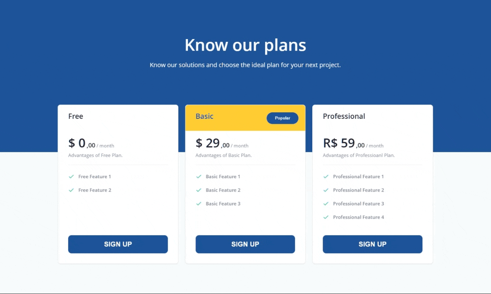

# frontend-pricingtable
<h2>Challenge frontend Pricing Table</h2>

<h2>Responsive Page</h2>

<strong>:hammer_and_wrench: Project:</strong> Convert figma Layout to Frontend code. Using:

<ul>
  <li> HTML</li>
  <li> CSS</li>
  <li> Sass SCSS</li>
  <li> Media Queries</li>
  <li> Flexbox</li>
</ul>

I wrote from scratch all code without any video reference.

In CSS, along with Sass, I'm using colors variables, viewport breakpoints, REM sizes, CSS reset, media queries, flexbox and grid.

<h3>Plus:</h3>

I added Sass to the project to help me on some CSS settings.

On this project, the design asked for a responsive code for desktop and mobile, showing the number of columns according to the viewport width.

There wasn't any mention about accessibility, but I decided to add it just for fun, with tabindexes in a logical order. Then also added some hover effects and a different outline color for the buttons, to help on the accessibility experience.

<h2>Example Images</h2>

Desktop 

Mobile 

